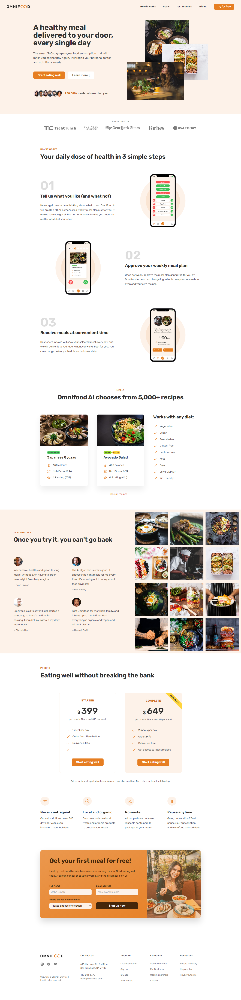

# Omnifood

Welcome to Omnifood, a project created as part of the "Build Responsive Real-World Websites with HTML5 and CSS3" course by Jonas Schmedtmann. Omnifood is a fictional food delivery service, and this repository serves as a showcase of the skills I've acquired while taking this course.

## Table of Contents

- [Description](#description)
- [Demo](#demo)
- [Technologies Used](#technologies-used)
- [Features](#features)
- [Installation](#installation)

## Description

Omnifood is a responsive website designed and built from scratch using HTML5 and CSS3. It is optimized for various screen sizes and devices, ensuring a seamless user experience.

## Demo

You can view a live demo of the Omnifood website [here](https://omnifood-no-cook.netlify.app).

## Technologies Used

- HTML5
- CSS3
- JavaScript

## Features

- Modern and responsive design
- Smooth navigation and animations
- User-friendly interface

## Installation

To run this project locally, follow these steps:

1. Clone this repository to your local machine.

2. Open the project directory.

3. Open the `index.html` file in your preferred web browser.
